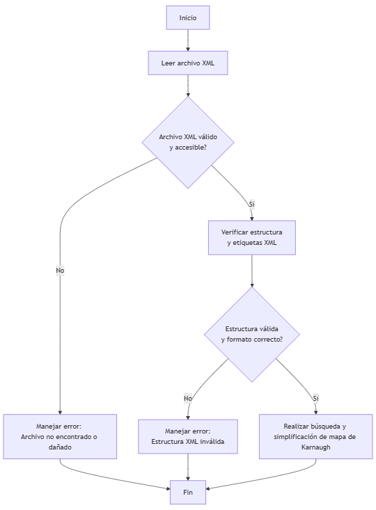
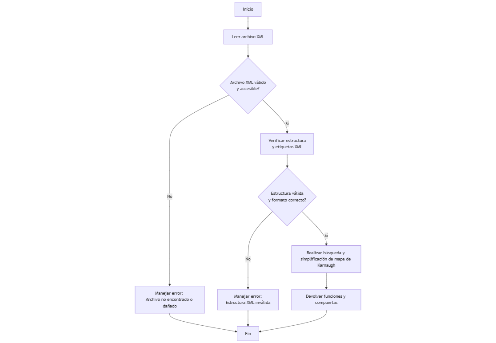

# Proyecto 1: Análisis de Mapas de Karnaugh en Java

**Curso:** Matemática para Computación 1  
**Sección:** C  
**Semestre:** Primer semestre 2025  
**Fecha:** Nueva Guatemala de la Asunción, 20 de abril de 2025

**Integrantes:**
- José Santiago Herrera Furlán — 202403244  
- Alysson Gabriela Benito Ixcoy — 202400225  

---

## 1. Introducción

Este proyecto tiene como objetivo desarrollar un software que permita a los usuarios trabajar con mapas de Karnaugh. El software:
- Lee un archivo XML con la definición del mapa.
- Procesa la información y calcula:
  - La función booleana canónica.
  - Su versión simplificada.
  - La cantidad de compuertas lógicas necesarias para su implementación.

Gracias al uso del **código Gray**, el programa soporta mapas de cualquier número de variables, asegurando que entre celdas contiguas solo cambie un bit.

---

## 2. Objetivos

**Objetivo general:**  
Desarrollar una aplicación de escritorio que lea un XML con un mapa de Karnaugh, lo procese, y genere funciones booleanas canónica y simplificada, junto con el cálculo de compuertas necesarias.

**Objetivos específicos:**
- Implementar lectura de archivos XML con mapas de Karnaugh.
- Generar visualmente el mapa en la interfaz.
- Calcular la función booleana canónica.
- Simplificar la función mediante agrupaciones.
- Calcular el número de compuertas lógicas.

---

## 3. Marco Teórico

### Mapas de Karnaugh  
Herramienta gráfica para simplificar funciones booleanas agrupando combinaciones que generan la misma salida.

### Funciones Booleanas  
Expresiones basadas en lógica binaria usando operadores AND, OR, NOT, etc.

### Código Gray  
Secuencia de bits donde entre dos elementos consecutivos cambia solo un bit. Es fundamental para el correcto funcionamiento de los mapas de Karnaugh.

---

## 4. Descripción del Problema

Simplificar funciones booleanas se complica con más variables. Este proyecto soluciona ese problema mediante un software que:
- Lee XMLs con funciones booleanas.
- Construye mapas automáticamente (ordenados por código Gray).
- Genera las formas canónica, simplificada y el cálculo de compuertas necesarias.
- Muestra resultados en una interfaz gráfica.

---

## 5. Propuesta Lograda

Aplicación de escritorio en Java con:
- Lectura de funciones booleanas desde archivos XML.
- Construcción automática del mapa de Karnaugh.
- Visualización amigable en GUI.

### 5.1.1 Requerimientos Específicos
1. Leer y validar archivo XML.
2. Procesar y construir el mapa según número de variables.
3. Calcular la función booleana canónica.
4. Simplificar usando agrupaciones de celdas (burbujas).
5. Determinar cantidad de compuertas necesarias.

### 5.1.2 Pasos del Algoritmo

#### Entrada:
- Archivo XML estructurado (con minitérminos/maxitérminos).
- Selección de número de variables (3, 4 o 5).

#### Salida:
- Visualización del mapa.
- Función booleana canónica.
- Función simplificada.
- Número de compuertas lógicas.

#### Pasos:
1. Leer XML y extraer términos.
2. Construir matriz del mapa de Karnaugh.
3. Mostrar mapa visualmente.
4. Agrupar términos adyacentes.
5. Aplicar simplificación.
6. Calcular compuertas necesarias.
7. Mostrar resultados.

---

## 5.2 Diagramas de Flujo

### Diagrama de Entrada y Salida de Datos

### Diagrama General de la Aplicación

---

## 6. Mockups del Software

### Ventana Principal
- Área de visualización del mapa.
- Botón para cargar archivo XML.
- Botón para calcular funciones.

### Ventana de Resultados
- Función booleana (canónica y simplificada).
- Número de compuertas necesarias.

---

## 7. Conclusiones

- El software es útil para estudiantes y profesionales.
- Cumple con los objetivos propuestos.
- Permite una ejecución rápida y comprensión clara del análisis lógico.
- Puede ser extendido o integrado con otros lenguajes.

---

## 8. Referencias

- Mano, M.M. & Ciletti, M.D. (2013). *Diseño digital (5ª ed.)*. Pearson Educación.
- Schildt, H. (2019). *Java: La referencia completa (11ª ed.)*. McGraw-Hill.
- Oracle. *Creación de GUI con Swing*.  
  [https://docs.oracle.com/javase/tutorial/uiswing/](https://docs.oracle.com/javase/tutorial/uiswing/)
